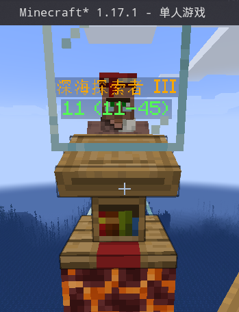
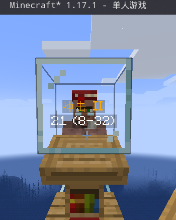
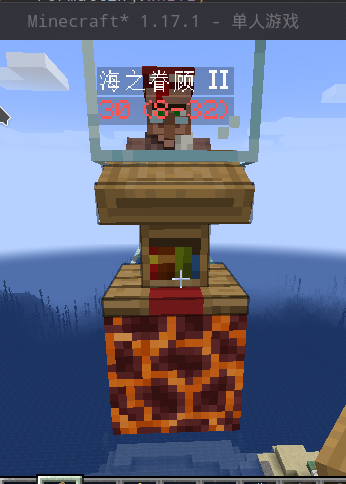

# Masa Gadget

[English](./README_EN.md)

❗在报告问题前，请务必尝试最新[测试版](https://github.com/plusls/MasaGadget/actions)，检查问题是否依然存在。

为 Masa 系列模组添加了一些特性。

默认使用 **G + C** 打开设置界面。

## 依赖项

| 依赖                     | 类型  | 下载                                                                                                                                                 |
|------------------------|-----|----------------------------------------------------------------------------------------------------------------------------------------------------|
| Fabric-API             | 必须  | [CurseForge](https://www.curseforge.com/minecraft/mc-mods/fabric-api) &#124; [Github](https://github.com/FabricMC/fabric)                          |
| Litematica             | 可选  | [CurseForge](https://www.curseforge.com/minecraft/mc-mods/litematica) &#124; [Masa WebSite](https://masa.dy.fi/mcmods/client_mods/?mod=litematica) |
| Magiclib               | 必须  | [CurseForge](https://www.curseforge.com/minecraft/mc-mods/magiclib) &#124; [Github](https://github.com/Hendrix-Shen/Magiclib)                      |
| MaliLib                | 必须  | [CurseForge](https://www.curseforge.com/minecraft/mc-mods/malilib) &#124; [Masa WebSite](https://masa.dy.fi/mcmods/client_mods/?mod=malilib)       |
| MiniHUD                | 可选  | [CurseForge](https://www.curseforge.com/minecraft/mc-mods/minihud) &#124; [Masa WebSite](https://masa.dy.fi/mcmods/client_mods/?mod=minihud)       |
| Plusls-Carpet-Addition | 可选  | [Github](https://github.com/plusls/plusls-carpet-addition)                                                                                         |
| Tweakeroo              | 可选  | [CurseForge](https://www.curseforge.com/minecraft/mc-mods/tweakeroo) &#124; [Masa WebSite](https://masa.dy.fi/mcmods/client_mods/?mod=tweakeroo)   |

## 特性
## 通用
## 自动同步实体数据 (autoSyncEntityData)
自动使用 PCA 同步协议来同步实体数据（如村民补货时间，僵尸村民转换时间，怪物是否消失）

- 分类: `通用`
- 类型: `开关`
- 默认值: `true`

## 缓存容器数据 (cacheContainerMenu)
在打开容器的时候会自动缓存容器数据到本地

- 分类: `通用`
- 类型: `带快捷键开关`
- 默认值: `true`, `无快捷键`

## 调试模式 (debug)
开启后将会打印调试日志

- 分类: `通用`
- 类型: `开关`
- 默认值: `false`

## 打开设置界面 (openConfigGui)
打开设置界面的快捷键

- 分类: `通用`
- 类型: `快捷键`
- 默认值: `G,C`

## 渲染村民交易补货冷却 (renderNextRestockTime)
渲染距离村民下一次补货还需要多长时间

- 分类: `通用`
- 类型: `带快捷键开关`
- 默认值: `true`, `无快捷键`

## 渲染村民交易的第一本附魔书 (renderTradeEnchantedBook)
渲染村民交易的第一本附魔书，如果是满级附魔则会显示金色文本，同时还会显示出价格，

绿色表示良商，白色表示中商，红色表示奸商

- 分类: `通用`
- 类型: `带快捷键开关`
- 默认值: `true`, `无快捷键`

良商:

中商:

奸商:

## 渲染村民绑定床 (renderVillageHomeTracer)
渲染村民到床的追踪线.

- 分类: `通用`
- 类型: `带快捷键开关`
- 默认值: `true`, `无快捷键`

## 渲染村民绑定床颜色 (renderVillageHomeTracerColor)
渲染村民绑定床追踪线颜色.

- 分类: `通用`
- 类型: `颜色`
- 默认值: `#500000FF`

## 渲染村民绑定工作方块 (renderVillageJobSiteTracer)
渲染村民到工作方块的追踪线

- 分类: `通用`
- 类型: `带快捷键开关`
- 默认值: `true`, `无快捷键`

## 渲染村民绑定工作方块颜色 (renderVillageJobSiteTracerColor)
渲染村民绑定工作方块追踪线颜色.

- 分类: `通用`
- 类型: `颜色`
- 默认值: `#50FF0000`

## 渲染僵尸村民转换时间 (renderZombieVillagerConvertTime)
渲染距离僵尸村民转换完成还需要多长时间

- 分类: `通用`
- 类型: `带快捷键开关`
- 默认值: `true`, `无快捷键`

## 搜寻可刷怪的地方 (searchMobSpawnPoint)
搜寻可刷怪的地方。需要在 minihud 中设置 §6怪物立刻消失范围球体§r，

亮度检查取决于 minihud 中的 §6lightLevelThresholdSafe§r 设置

- 分类: `通用`
- 类型: `快捷键`
- 默认值: `无快捷键`
- 依赖:
  - 与 (需要满足全部条件):
    - minihud: *

## 搜寻刷怪点黑名单 (searchMobSpawnPointBlackList)
在黑名单中的方块会跳过搜索

- 分类: `通用`
- 类型: `字符串列表`
- 默认值: `[]`
- 依赖:
  - 与 (需要满足全部条件):
    - minihud: *

## 同步所有实体数据 (syncAllEntityData)
使用 pca 同步协议同步所有实体数据

- 分类: `通用`
- 类型: `快捷键`
- 默认值: `无快捷键`

## Litematica
## 更好的轻松放置模式 (betterEasyPlaceMode)
轻松放置时可以打开容器（比如箱子，漏斗等等），以及可以使用信标

- 分类: `Litematica`
- 类型: `带快捷键开关`
- 默认值: `false`, `无快捷键`
- 依赖:
  - 与 (需要满足全部条件):
    - litematica: *

## 禁用投影轻松放置失败提示 (disableLitematicaEasyPlaceFailTip)
禁用轻松放置失败时那烦人的提示窗

- 分类: `Litematica`
- 类型: `带快捷键开关`
- 默认值: `false`, `无快捷键`
- 依赖:
  - 与 (需要满足全部条件):
    - litematica: *

## 修复精准放置协议 (fixAccurateProtocol)
Litematica 本身的精准放置协议实现的有问题，修复后可以在服务器中使用轻松放置来摆放中继器，

活塞，侦测器，楼梯等方块

- 分类: `Litematica`
- 类型: `带快捷键开关`
- 默认值: `false`, `无快捷键`
- 依赖:
  - 与 (需要满足全部条件):
    - litematica: *

## 移动投影时支持 Free Camera (nudgeSelectionSupportFreeCamera)
在开启 Free Camera 时，移动投影的方向会取决于 Camera 的方向

- 分类: `Litematica`
- 类型: `开关`
- 默认值: `true`
- 依赖:
  - 与 (需要满足全部条件):
    - litematica: *
    - tweakeroo: *
    - minecraft: <=1.15.2

## 服务器中保存投影保留容器数据 (saveInventoryToSchematicInServer)
保存投影时会使用 PCA 同步协议来同步容器中的数据到本地

- 分类: `Litematica`
- 类型: `开关`
- 默认值: `false`
- 依赖:
  - 与 (需要满足全部条件):
    - litematica: *

## 使用相对路径 (useRelativePath)
加载和保存投影时使用相对路径

- 分类: `Litematica`
- 类型: `开关`
- 默认值: `false`
- 依赖:
  - 与 (需要满足全部条件):
    - litematica: *

## Malilib
## 移植 i18n 支持 (backportI18nSupport)
让 masa 系 mod 支持 malilib 的 1.18.x 的 i18n 移植

- 分类: `Malilib`
- 类型: `开关`
- 默认值: `true`
- 依赖:
  - 与 (需要满足全部条件):
    - minecraft: <=1.17.1

## 快速切换 Masa mod 配置界面 (fastSwitchMasaConfigGui)
可以通过右上角的下拉菜单快速切换到别的 masa mod 的设置界面

- 分类: `Malilib`
- 类型: `带快捷键开关`
- 默认值: `true`, `无快捷键`
- 依赖:
  - 与 (需要满足全部条件):
    - modmenu: *

## 收藏夹支持 (favoritesSupport)
可以收藏并过滤出自己喜欢的选项

- 分类: `Malilib`
- 类型: `带快捷键开关`
- 默认值: `false`, `无快捷键`

## 修复 Masa 配置文本的宽度 (fixConfigWidgetWidth)
在使用汉化包后现在的界面会根据汉化后的文本长度自动调节

- 分类: `Malilib`
- 类型: `开关`
- 默认值: `true`
- 依赖:
  - 与 (需要满足全部条件):
    - minecraft: <=1.17.1

## 修复容器类型 (fixGetInventoryType)
修复对烟熏炉之类的熔炉变种的容器类型的判断

- 分类: `Malilib`
- 类型: `开关`
- 默认值: `true`
- 依赖:
  - 与 (需要满足全部条件):
    - minecraft: <=1.17.1

## 修复搜索框按键输入 (fixSearchbarHotkeyInput)
修复用热键打开配置界面时会在搜索框产生错误输入的 bug

- 分类: `Malilib`
- 类型: `开关`
- 默认值: `true`

## Masa 搜索优化 (optimizeConfigWidgetSearch)
在 Masa 家的搜索栏中可以使用中文搜索，还能使用 §6modified§r 来搜索修改过的配置项

- 分类: `Malilib`
- 类型: `开关`
- 默认值: `true`
- 依赖:
  - 与 (需要满足全部条件):
    - minecraft: <=1.17.1

## 显示原始的配置选项名 (showOriginalConfigName)
如果当前显示的配置选项名和原始名字不一致时，在下方显示原始的配置名（英文）

- 分类: `Malilib`
- 类型: `带快捷键开关`
- 默认值: `false`, `无快捷键`

## 显示原始的配置选项名字体大小 (showOriginalConfigNameScale)
原始的配置选项名字体大小

- 分类: `Malilib`
- 类型: `双精度浮点`
- 默认值: `0.65`
- 最小值: `0.0`
- 最大值: `2.0`

## Minihud
## Minihud 支持翻译 (minihudI18n)
Minihud 显示的文本可以被翻译

- 分类: `Minihud`
- 类型: `带快捷键开关`
- 默认值: `true`, `无快捷键`
- 依赖:
  - 与 (需要满足全部条件):
    - minihud: *

## PCA同步协议同步蜂巢数据 (pcaSyncProtocolSyncBeehive)
按下 §6容器预览§r 的快捷键将会使用 PCA 同步协议来 同步蜂巢，蜂箱数据

- 分类: `Minihud`
- 类型: `开关`
- 默认值: `true`
- 依赖:
  - 与 (需要满足全部条件):
    - minihud: *
    - tweakeroo: *
    - minecraft: >1.14.4

## Tweakeroo
## 容器预览支持比较器 (inventoryPreviewSupportComparator)
对比较器使用容器预览时将会显示比较器应该输出的信号

- 分类: `Tweakeroo`
- 类型: `开关`
- 默认值: `true`
- 依赖:
  - 与 (需要满足全部条件):
    - tweakeroo: *

## 容器预览支持预览玩家 (inventoryPreviewSupportPlayer)
对着玩家使用容器预览时，会显示出玩家背包和末影箱的内容

- 分类: `Tweakeroo`
- 类型: `开关`
- 默认值: `true`
- 依赖:
  - 与 (需要满足全部条件):
    - tweakeroo: *

## 容器预览支持选中格子 (inventoryPreviewSupportSelect)
按下容器预览快捷键时可以使用鼠标滚轮来选中物品（可以查看附魔信息），

在选中箱子中的潜影盒时可以按下鼠标中键来预览盒子内的物品

- 分类: `Tweakeroo`
- 类型: `带快捷键开关`
- 默认值: `true`, `无快捷键`
- 依赖:
  - 与 (需要满足全部条件):
    - tweakeroo: *

## 容器预览支持潜影盒实体 (inventoryPreviewSupportShulkerBoxItemEntity)
容器预览支持潜影盒实体

- 分类: `Tweakeroo`
- 类型: `开关`
- 默认值: `true`
- 依赖:
  - 与 (需要满足全部条件):
    - tweakeroo: *

## 容器预览显示交易列表 (inventoryPreviewSupportTradeOfferList)
容器预览村民时会显示出当前的交易列表

- 分类: `Tweakeroo`
- 类型: `开关`
- 默认值: `true`
- 依赖:
  - 与 (需要满足全部条件):
    - tweakeroo: *

## 容器预览时同步数据 (inventoryPreviewSyncData)
容器预览时使用 PCA 同步协议来从服务器同步方块实体信息和实体信息，比如箱子内的物品，村民背包

- 分类: `Tweakeroo`
- 类型: `带快捷键开关`
- 默认值: `true`, `无快捷键`
- 依赖:
  - 与 (需要满足全部条件):
    - tweakeroo: *

## 容器预览时同步数据（仅客户端） (inventoryPreviewSyncDataClientOnly)
容器预览时模拟开启容器来同步容器的信息

- 分类: `Tweakeroo`
- 类型: `带快捷键开关`
- 默认值: `false`, `无快捷键`
- 依赖:
  - 与 (需要满足全部条件):
    - tweakeroo: *

## 容器预览时使用缓存 (inventoryPreviewUseCache)
容器预览时从缓存中获取指向的方块和实体数据，从而减少渲染时的卡顿

- 分类: `Tweakeroo`
- 类型: `开关`
- 默认值: `true`
- 依赖:
  - 与 (需要满足全部条件):
    - tweakeroo: *

## 自动补货允许 2x2 合成 (restockWithCrafting)
当背包内没有自动物品而 Tweakeroo 需要自动补货时，

通过预先定义的合成表自动合成相应物品。此功能需要 ItemScroller。

- 分类: `Tweakeroo`
- 类型: `带快捷键开关`
- 默认值: `true`, `无快捷键`
- 依赖:
  - 与 (需要满足全部条件):
    - tweakeroo: *
    - itemscroller: *

## 自动补货合成配方 (restockWithCraftingRecipes)
ItemScroller 存储的配方编号，只支持 2x2 配方

- 分类: `Tweakeroo`
- 类型: `字符串列表`
- 默认值: `[]`
- 依赖:
  - 与 (需要满足全部条件):
    - tweakeroo: *
    - itemscroller: *

## 开发

### 支持

当前主开发版本：1.20.1

并且使用 `预处理` 来兼容各版本。

**注意: 我们仅接受以下版本的议题。请注意该信息的时效性，任何不在此列出的版本议题均会被关闭。**

- Minecraft 1.14.4
- Minecraft 1.15.2
- Minecraft 1.16.5
- Minecraft 1.17.1
- Minecraft 1.18.2
- Minecraft 1.19.2
- Minecraft 1.19.3
- Minecraft 1.19.4
- Minecraft 1.20.1

### 混淆映射表

我们使用 **Mojang 官方** 混淆映射表来反混淆 Minecraft 并插入补丁程序。

### 文档

英文文档与中文文档是逐行对应的。

## 许可

此项目在 LGPL-3.0许可证 下可用。 从中学习，并将其融入到您自己的项目中。
